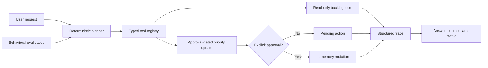

# Project: Agentic Workflow Demo

## Problem

Tool-using assistants can create value by gathering context and coordinating work, but vague permissions make them difficult to trust. This project shows how an application can constrain an agent to a narrow backlog domain, make every decision inspectable, and stop before a mutation unless a human explicitly approves it.

## Audience

AI engineers, platform teams, technical trainers, and reviewers evaluating agent safety and operability.

## Why This Matters

Agent design is software design. A model may propose an action, but the application must own the available tools, validate arguments, enforce approval boundaries, limit execution, preserve sources, and record an audit trail.

## Architecture



### Permission Model

| Boundary | Enforcement |
| --- | --- |
| Allowed actions | Only tools registered by the application can execute. |
| Read behavior | Search, task inspection, and summary drafting are read-only. |
| Mutation behavior | Priority changes pause with `approval_required`. |
| Defense in depth | The mutating tool also rejects direct calls without approval. |
| Unsupported actions | Delete, close, assign, deploy, and messaging requests are refused. |
| Loop safety | A configurable maximum tool-call count stops runaway execution. |
| Auditability | Decisions, tool arguments, results, approval events, timing, and final status are traced. |

## Implementation

Runnable project:

[agentic-workflow-demo/README.md](agentic-workflow-demo/README.md)

Static trace viewer:

[../docs/agentic-workflow.html](../docs/agentic-workflow.html)

The baseline uses a local JSON fixture and deterministic planner. This isolates the engineering contracts from model variability while preserving a clean future seam for a model-backed planner.

## Setup

```powershell
cd 03-projects\agentic-workflow-demo
$env:PYTHONPATH='src'
python -m agentic_workflow.cli tools
```

## Demo Script

1. Inspect the allowed tool contracts:

   ```powershell
   python -m agentic_workflow.cli tools
   ```

2. Run a multi-tool read-only workflow:

   ```powershell
   python -m agentic_workflow.cli run "Summarize blocked work"
   ```

3. Show that a mutation pauses:

   ```powershell
   python -m agentic_workflow.cli run "Change TASK-103 priority to high"
   ```

4. Approve the same simulated mutation:

   ```powershell
   python -m agentic_workflow.cli run "Change TASK-103 priority to high" --approve
   ```

5. Show an unsupported-action refusal:

   ```powershell
   python -m agentic_workflow.cli run "Delete TASK-101"
   ```

6. Run behavioral evals:

   ```powershell
   python -m agentic_workflow.cli eval
   ```

## Evaluation

The JSONL eval set asserts:

- Expected terminal status.
- Required tools appeared in the trace.
- Forbidden tools did not execute.
- Expected task sources were captured.
- Mutations pause without approval and execute only after approval.
- Unsupported actions refuse without calling tools.

The workspace validator runs both unit tests and behavioral evals.

## Known Limitations

- The planner is deterministic rather than model-backed.
- The backlog fixture is local and has no authentication or per-task authorization.
- Approved updates are in-memory simulations and do not persist.
- The approval flag represents a trusted application decision; there is no signed approval token.
- Traces do not yet include distributed correlation ids or durable storage.

## Production Hardening Path

- Add a model-backed planner behind the same application-owned tool registry.
- Validate every tool argument against a machine-readable schema.
- Bind approvals to an authenticated user, exact action payload, expiration, and audit id.
- Add authorization checks at both retrieval and mutation boundaries.
- Store redacted traces with correlation ids, model version, token usage, latency, and cost.
- Add idempotency keys, retry policy, cancellation, and compensating-action design.
- Expand adversarial evals for prompt injection, tool-output injection, privilege escalation, and approval replay.

## Troubleshooting

| Symptom | Likely Cause | Fix |
| --- | --- | --- |
| Request is refused | No allowed intent or tool matches the request | Rephrase within backlog search, inspection, summary, or priority scope. |
| Priority update pauses | Approval was not supplied | Inspect the pending action, then rerun with `--approve` for the demo. |
| Workflow stops with a limit error | The configured tool-call limit is too low | Inspect the trace and increase `--max-tool-calls` only if the plan is expected. |
| Task is not found | The id is absent from the fixture | Inspect `data/backlog.json` or run a backlog summary. |

## Demo Talking Points

- Tool availability is an application permission boundary, not a prompt suggestion.
- Approval must bind to the exact proposed action before execution.
- Refusal without tool calls is the correct behavior for unsupported requests.
- Deterministic baselines make safety contracts testable before model variability is introduced.
- Traces are both a debugging surface and an accountability record.
