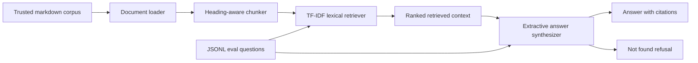

# Project: Enablement Assistant RAG

## Problem

Personal notes and project docs pile up quickly. An enablement assistant should answer from the trusted notebook, show exactly which sources it used, and refuse questions that are not covered by the corpus.

## Audience

AI engineers, technical trainers, and enablement leads who need to turn a living knowledge base into quick, auditable answers.

## Why This Matters

The interesting part of a RAG system is not only getting an answer. It is making the answer inspectable. This prototype demonstrates source-aware retrieval, citation discipline, a refusal path, and a repeatable evaluation loop.

## Architecture



```text
Markdown corpus
  -> document loader
  -> section-aware chunker
  -> lexical retriever
  -> grounded answer synthesizer
  -> citations, retrieved context, and eval metrics
```

### Components

| Component | Prototype Choice | Production Path |
| --- | --- | --- |
| Corpus | Local markdown files | Versioned docs, permissions, freshness metadata |
| Chunking | Heading-aware chunks with line ranges | Tuned chunk sizes by document type |
| Retrieval | Local TF-IDF style retrieval | Embeddings plus hybrid keyword search |
| Generation | Extractive synthesis from retrieved text | Model gateway with strict grounded-answer prompt |
| Citations | File, heading, and line range | Stable document ids and source URLs |
| Evaluation | JSONL question set | CI gate with source-hit, refusal, and answer-quality checks |

## Implementation

Runnable prototype:

[03-projects/enablement-assistant/README.md](enablement-assistant/README.md)

Deployed static demo:

[docs/enablement-assistant.html](../docs/enablement-assistant.html)

Core behavior:

- Loads markdown from the notebook.
- Preserves source path, heading, and line ranges.
- Retrieves ranked chunks for a question.
- Produces cited answers from retrieved text.
- Returns "I could not find this in the indexed sources" for uncovered questions.
- Runs a small evaluation set for source hit and refusal behavior.

## Setup

```powershell
cd 03-projects\enablement-assistant
python -m venv .venv
.\.venv\Scripts\Activate.ps1
pip install -e .
```

Dependency-light path without installing:

PowerShell:

```powershell
cd 03-projects\enablement-assistant
$env:PYTHONPATH='src'
python -m enablement_assistant.cli ask "What are common RAG failure modes?" --show-context
```

Bash or Git Bash:

```bash
cd 03-projects/enablement-assistant
PYTHONPATH=src python -m enablement_assistant.cli ask "What are common RAG failure modes?" --show-context
```

## Demo Script

1. Ask a directly answered question:

   ```powershell
   enablement-assistant ask "What are common RAG failure modes?" --show-context
   ```

2. Ask a project standards question:

   ```powershell
   enablement-assistant ask "How should projects be documented?"
   ```

3. Ask an uncovered question:

   ```powershell
   enablement-assistant ask "What is the capital of France?"
   ```

4. Show retrieval without synthesis:

   ```powershell
   enablement-assistant retrieve "chunking and metadata" --top-k 5
   ```

5. Run the evaluation set:

   ```powershell
   enablement-assistant eval
   ```

## Evaluation

Evaluation questions live in [evals/questions.jsonl](enablement-assistant/evals/questions.jsonl). Each row records:

- Question.
- Expected source file.
- Whether the assistant should answer.

Current checks:

- The expected source appears in the retrieved set.
- Covered questions produce a cited answer.
- Uncovered questions trigger the refusal path.

Future checks:

- Citation precision by line range.
- Answer completeness rubric.
- Regression set for ambiguous questions.
- Retrieval comparison across chunk sizes and hybrid search.

## Production Readiness Notes

What is prototype-grade:

- Local lexical retrieval.
- Extractive answer synthesis.
- Local markdown-only corpus.
- CLI interface.

What is production-shaped:

- Clear module boundaries for loader, retriever, synthesizer, and CLI.
- Stable citation contract.
- Observable retrieved context.
- Repeatable eval command.
- Refusal behavior for unsupported questions.
- No secrets or external services required for the baseline.

## Known Limitations

- Lexical retrieval misses semantic matches and synonyms.
- Extractive answers can read like source snippets instead of a polished assistant response.
- No user authentication, document permissions, or tenant separation.
- No freshness tracking for stale documents.
- No cost, latency, or model telemetry because the baseline does not call a model.

## Troubleshooting

| Symptom | Likely Cause | Fix |
| --- | --- | --- |
| Good source not retrieved | Query terms do not match corpus wording | Try `retrieve`, inspect top chunks, then tune chunking or add synonym support |
| Unsupported answer appears grounded | Corpus contains the question as an example | Exclude demo, test, or implementation docs from the default corpus |
| Answer is too terse | Extractive synthesis only selected a narrow sentence | Increase retrieved chunks or add an LLM synthesis layer |
| Citation line range is too broad | Chunk size is too large | Lower target chunk words or split by section type |

## Demo Talking Points

- RAG improves grounding but does not guarantee truth.
- Retrieval quality is often the bottleneck.
- Source metadata makes answers auditable.
- "Not found in sources" is a feature, not a failure.
- Evaluation needs test questions, expected sources, and expected answer traits.
