# Project: Live Support Triage Studio

## Problem

Customer teams often see an impressive model response without seeing the application controls required to make it useful. Support operations need a bounded workflow that converts an unstructured ticket into a consistent triage record while making validation, configuration, failure handling, and privacy boundaries visible.

## Audience

Support-operations leaders, AI engineers, solution architects, forward deployed trainers, and customer teams moving from a prompt prototype toward a deployed workflow.

## Live Experience

- [Canonical deployed Support Triage Studio](https://ai-engineering-notebook.vercel.app/support-triage)
- [Recorded GitHub Pages mirror](https://pablodcruz.github.io/ai-engineering-notebook/docs/support-triage.html)
- [Deploy-your-own guide](../docs/deploy-support-triage.html)
- [AI application operating economics](../04-explainers/ai-app-operating-economics.md)
- `POST /api/triage` for live, schema-validated generation
- `GET /api/health` for deployment configuration health
- [Prompt regression evidence](../docs/prompt-regression-report.html) for the prompt behind the workflow

The same page works in two explicit modes. Recorded examples remain publicly available without inference cost. A configured Vercel deployment can run only three allowlisted synthetic cases through an access-code-protected live API. Technical reviewers can deploy their own copy without sharing a provider key with this site.

## Verified Deployment

The canonical Vercel deployment has completed an end-to-end live run against a funded provider project. The verified path includes browser access control, server-side sample loading, the atomic Redis daily claim, OpenAI generation, exact-schema validation, and response telemetry.

The same deployment was also exercised through a real provider failure: an exhausted API quota returned a safe browser error with an application request id while Vercel logs captured only the provider status, error code, exception type, stage, and provider request id. After credits were added, the same request succeeded without a code change. This demonstrates that application failures can be separated from provider-account failures without exposing prompts, tickets, credentials, or raw exception messages.

Cost exposure is bounded in layers: recorded mode makes no inference call; live mode requires an access code and accepts only synthetic allowlisted cases; a global Redis ceiling limits daily claims; output is capped; `TRIAGE_LIVE_ENABLED` can stop calls immediately; and the deployment owner uses finite prepaid provider credits with automatic recharge disabled. The application controls request volume, while the provider balance is the final account-level backstop.

## Architecture

```mermaid
flowchart LR
    Browser["Browser: synthetic sample id"] --> Gateway["Vercel Python gateway"]
    Gateway --> Sample["Server-side sample allowlist"]
    Sample --> Bounds["Access + client rate limit"]
    Bounds --> Daily["Atomic shared UTC daily ceiling"]
    Daily --> Prompt["Server-side structured-v2 prompt"]
    Prompt --> API["OpenAI Responses API"]
    API --> Validator["Shared exact-schema validator"]
    Validator -->|pass| Result["Triage result + telemetry"]
    Validator -->|fail| Error["Visible contract error"]
    Fixture["Reviewed T001 fixture"] -->|explicit recorded mode| Browser
    Regression["15-case regression runner"] --> Prompt
```



## Application Contract

Every successful response contains exactly five workflow fields:

| Field | Purpose |
| --- | --- |
| `customer_problem` | Concise, grounded summary of the reported issue. |
| `product_area` | One controlled workflow category. |
| `urgency` | One controlled priority label. |
| `missing_information` | Context needed before acting or escalating. |
| `recommended_response` | A bounded next step without invented actions. |

The gateway validates this contract after generation. Invalid model output returns an error; it is never passed to the browser as a successful result.

## Local Setup

1. Copy `.env.example` to a local `.env` file and replace every placeholder.
2. Install `requirements.txt` in a virtual environment.
3. Run through the Vercel development server so the static page and Python functions share one origin.
4. Open `/support-triage.html`, select one of the three synthetic cases, and provide the demo access code.

Never put the provider API key in the page or browser storage.

The deployment pins the official Python SDK version so a rebuild does not silently change the runtime client contract. Upgrade that pin intentionally and rerun the full workspace gate.

## Vercel Configuration

Set these server-side environment variables:

- `OPENAI_API_KEY`: provider credential.
- `OPENAI_MODEL`: an explicit model snapshot or approved model id.
- `TRIAGE_LIVE_ENABLED`: emergency kill switch; start with `false`.
- `TRIAGE_DEMO_ACCESS_CODE`: required shared demo gate.
- `TRIAGE_RATE_LIMIT`: optional per-instance requests per minute; default `8`.
- `TRIAGE_DAILY_LIMIT`: shared maximum live claims per UTC day; default `100`.
- `TRIAGE_ALLOWED_ORIGIN`: allowed browser origin; set this to the canonical Vercel URL for deployment.
- `UPSTASH_REDIS_REST_URL`: Vercel Marketplace-injected shared-counter URL.
- `UPSTASH_REDIS_REST_TOKEN`: Vercel Marketplace-injected shared-counter credential.

The per-client limiter remains a best-effort control scoped to a warm function instance. The separate Upstash counter is global across instances and atomically claims from the daily ceiling before any provider call. If that counter is unavailable, live mode fails closed.

After deployment, verify configuration without submitting a ticket:

```powershell
python scripts/check_live_triage.py https://your-project.vercel.app --expect-configured
```

The manual **Live Triage Smoke Check** GitHub Actions workflow runs the same health contract against a supplied canonical URL.

## Demo Script

1. Start with the password-reset sample and identify the workflow decision.
2. Run live triage and inspect the five output fields.
3. Show the contract-pass badge, prompt version, model id, latency, token counts, and request id.
4. Explain why the browser never receives the API key or prompt file.
5. Open the prompt regression report and connect this one request to 15 fixed evaluation cases.
6. Disconnect or use the GitHub Pages mirror, then load the explicitly recorded example.
7. Ask the audience which classifications, escalation rules, and retention policies must change for their environment.

## Operational Controls

- Fixed prompt loaded on the server.
- Exact structured-output schema shared with the regression runner.
- Only `T001`, `T002`, and `T003` are accepted in public live mode; the server loads their text.
- Internal ticket input limited to 1,000 characters and provider output limited to 300 tokens.
- Required constant-time access-code check.
- Best-effort request throttling by forwarded client address.
- Atomic, shared UTC-day request ceiling before the provider call.
- Environment-controlled emergency kill switch.
- No application persistence and `store: false` on the provider request.
- Generic provider errors that do not expose internal exceptions.
- Thirty-second browser timeout and no silent fallback.
- Health endpoint that reports configuration presence without revealing secret values.

## Evaluation Story

The live workflow answers “Can a customer use it now?” The regression runner answers “How do we know a prompt change did not break known behavior?” They share the same prompt and output validator, so the public demo and the evaluation evidence are one system rather than unrelated samples.

## Known Limitations

- The per-client limiter is not global across serverless instances; the aggregate daily ceiling is global.
- A shared access code is not user identity or enterprise authorization.
- The health endpoint checks configuration presence, not a billable provider call.
- No ticket history, reviewer queue, human override, or customer-system integration is implemented.
- Public live mode intentionally cannot accept arbitrary customer tickets.
- The deterministic schema validator cannot judge every subjective support-quality dimension.
- “Not stored by app” does not define the model provider's data controls; the deployment owner must configure and disclose those separately.

## Production Hardening Path

- Add identity-aware authentication, authorization, audit records, and a shared rate-limit store.
- Add PII detection/redaction and customer-approved retention policies before real ticket traffic.
- Replace generic categories with customer-owned taxonomies and escalation service-level objectives.
- Add human review for high-impact tickets and an override feedback loop.
- Track cost, latency percentiles, contract errors, refusals, category drift, and reviewer agreement.
- Run prompt candidates in shadow mode against representative, privacy-reviewed traffic before promotion.

## Forward Deployed Trainer Signals

- Begins with a real customer workflow rather than an isolated prompt.
- Makes the live path, reproducible path, and failure path equally teachable.
- Connects product behavior to deployment controls and evaluation evidence.
- States where demo-grade controls end and production requirements begin.
- Gives a customer team concrete questions about taxonomy, ownership, privacy, escalation, and success metrics.
