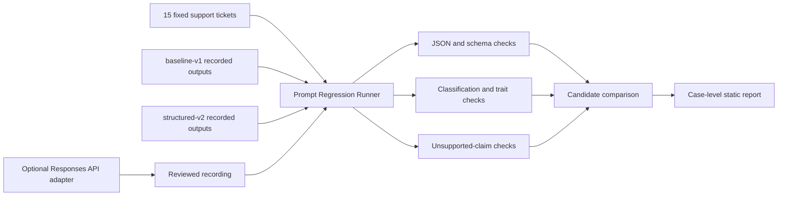

# Project: Prompt Regression Runner

## Problem

A prompt change can make output look better while silently breaking classification, structure, grounding, or missing-information behavior. Teams need a repeatable way to compare candidates on the same inputs before promoting a prompt.

The terminology matters for enablement: this is an evaluation runner, not an agent harness that gives a model computer access.

## Audience

AI engineers, support-operations teams, forward deployed trainers, solution architects, and customer teams learning how to operationalize prompt changes.

## Why This Matters

Forward deployed work often moves from a successful one-off demo to the harder question: "How will we know this still works after we change it?" This project gives a trainer a concrete bridge from prompt-writing intuition to engineering discipline.

## Architecture

## The Evaluation Contract

| Check | What It Demonstrates | Why A Trainer Should Care |
| --- | --- | --- |
| JSON validity | Output can be parsed | A polished paragraph may still be unusable by software. |
| Exact schema | Required fields and allowed values are stable | Prompt instructions do not replace application validation. |
| Product area | The classification matches the scenario | Format correctness is not task correctness. |
| Urgency | Business policy is applied consistently | Teams must make decision rules explicit. |
| Problem traits | Important ticket evidence is preserved | Summaries can be fluent but incomplete. |
| Missing information | The system knows what it still needs | Honest uncertainty is a product behavior. |
| Grounding | Unsupported claims are absent | The model must not invent root causes or completed actions. |
| Actionability | The response supports the next workflow step | Evaluation should reflect user value, not only syntax. |

## Implementation

- [Runnable project](prompt-regression-runner/README.md)
- [Static comparison report](../docs/prompt-regression-report.html)
- [Live workflow using the same contract](../docs/support-triage.html)
- [Facilitator guide](../04-explainers/prompt-evaluation-facilitator-guide.md)

The deterministic baseline compares committed recordings. The optional live adapter generates candidate outputs with an explicit model id, then hands the recording to the same provider-independent scorer.

## Demo Script

1. Start with the vague prompt and ask the audience what "good" means.
2. Reveal the eight checks and discuss which are deterministic.
3. Compare both candidates and inspect the 55.0% versus 100% result.
4. Drill into the password-reset case to show invalid JSON and missing evidence.
5. Drill into the vague ticket to show `unknown` classification and clarification behavior.
6. Introduce the optional live adapter and explain why CI uses reviewed recordings.
7. Ask the audience which customer-specific policies should become new cases.

## Evaluation

The project quality gate requires:

- Exactly 15 unique cases across at least five categories.
- `structured-v2` to score at least 95%.
- `structured-v2` to beat `baseline-v1` by at least 25 percentage points.
- Every structured candidate case to pass in the committed baseline.
- The exported comparison report to match current prompts, cases, recordings, and scoring logic.

## Forward Deployed Trainer Signals

- Translates an unfamiliar concept into plain, product, and engineering language.
- Starts with a customer workflow rather than model trivia.
- Makes hidden business rules discussable and testable.
- Provides a credential-free classroom path and an optional real-service path.
- Demonstrates a failure first, then connects each mitigation to evidence.
- Leaves room for customer-specific rubric design and human review.

## Known Limitations

- Recorded fixtures illustrate behavior but do not establish the performance of a named model.
- Exact keyword checks can mark semantically equivalent language as a failure.
- A single correct expected label can hide legitimate ambiguity.
- No inter-rater agreement or human-review calibration is included yet.
- The live adapter requires local credentials, the optional OpenAI SDK, and intentional cost controls.

## Production Hardening Path

- Version datasets, prompts, model ids, inference parameters, and scorer versions together.
- Add blinded human review for subjective quality dimensions.
- Calibrate label ambiguity and acceptable semantic variants with domain experts.
- Track latency, token usage, cost, refusal, and safety metrics separately.
- Add privacy review and retention rules before recording customer data.
- Use shadow evaluation and staged rollout before replacing a production prompt.

## Demo Talking Points

- A prompt is part of the product contract, not merely text in a playground.
- Valid JSON is necessary but not sufficient.
- Aggregate scores guide investigation; case-level failures drive decisions.
- Recorded evaluation and live generation solve different problems.
- The best rubric is co-designed with the people who own the workflow.
