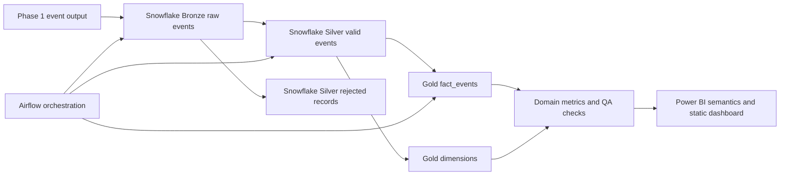

# StreamFlow Phase 2

Enterprise analytics pipeline prototype for turning StreamFlow Phase 1 event output into Snowflake warehouse tables and Power BI-ready metrics.

## Problem

Phase 1 proves that events can be produced, streamed, validated, and written to durable files. Phase 2 answers the next question: how does that operational event stream become trusted business insight?

This project models the downstream warehouse and BI layer:



```text
Phase 1 output -> Snowflake Bronze -> Silver -> Gold star schema -> Power BI
```

## What It Builds

```text
Phase 1 Parquet or JSON export
    -> Snowflake stage
    -> Bronze raw event table
    -> Silver typed and deduplicated events
    -> Gold fact and dimensions
    -> Power BI semantic model and dashboard requirements
```

The project is intentionally separate from Phase 1. Phase 1 owns streaming infrastructure; Phase 2 owns warehouse modeling, BI contracts, and analytics validation.

## Local Validation

These checks do not require Snowflake, Airflow, or Power BI:

```bash
cd 03-projects/streamflow-enterprise-analytics-pipeline
python -m unittest discover -s tests
```

The tests verify the expected project structure, required SQL files, idempotent table creation patterns, merge/dedup logic, quality checks, and Power BI measure documentation.

## Live Demo Prerequisites

- Snowflake account with permission to create a database, warehouse, schemas, stages, tables, and file formats.
- Airflow environment with the Snowflake provider installed.
- Power BI Desktop for opening a model connected to the Gold schema.
- Phase 1 output data from `../streamflow-containerized-stream-processing/data/raw/events` or a JSON export from the producer.

Credentials belong in environment variables or an untracked `.env` file. Do not commit real account names, private keys, passwords, or tokens.

## Suggested Execution Order

1. Review and copy `config/snowflake.example.yml` into a local untracked config file.
2. Run `sql/bronze/create_bronze_tables.sql`.
3. Upload Phase 1 files to the configured Snowflake stage.
4. Run `sql/bronze/load_bronze_events_from_parquet.sql` for Spark output, or `sql/bronze/load_bronze_events.sql` for JSON exports.
5. Run `sql/silver/create_silver_tables.sql`.
6. Run `sql/silver/transform_silver_events.sql`.
7. Run `sql/silver/quality_checks.sql`.
8. Run `sql/gold/create_gold_tables.sql`.
9. Run `sql/gold/build_dimensions.sql`.
10. Run `sql/gold/build_fact_events.sql`.
11. Run `sql/gold/build_domain_metrics.sql`.
12. Run `tests/reconciliation_checks.sql`.
13. Connect Power BI to the Gold schema and implement `powerbi/measures.md`.

## Warehouse Design

| Layer | Schema | Purpose |
| --- | --- | --- |
| Bronze | `BRONZE` | Raw payload preservation, source file metadata, load run metadata. |
| Silver | `SILVER` | Clean typed events, rejected records, deduplication by `event_id`. |
| Gold | `GOLD` | Fact and dimension tables for business intelligence. |
| Tests | `ANALYTICS` queries | Reconciliation, duplicate, null, join, and KPI checks. |

## Domain Model

Phase 1 currently emits ecommerce/media-style events:

- `page_view`
- `add_to_cart`
- `purchase`
- `video_play`

The Gold layer keeps a generic `fact_events` table and adds `fact_commerce_metrics` only when payload fields such as `amount` and `currency` support commerce KPIs.

## Airflow

`airflow/dags/snowflake_pipeline.py` defines a task sequence for live orchestration:

```text
check_source_contract
  -> load_bronze_events
  -> run_silver_transformations
  -> run_quality_checks
  -> build_gold_dimensions
  -> build_gold_facts
  -> publish_run_summary
```

The DAG is a production-shaped template. It expects a Snowflake connection named `streamflow_snowflake` and SQL files mounted at `/opt/streamflow-analytics/sql`.

## Power BI

The repository does not commit a `.pbix` binary. Instead it includes:

- `powerbi/measures.md` for DAX measures and validation queries.
- `docs/dashboard_requirements.md` for report pages, filters, and QA expectations.
- `docs/data_dictionary.md` for table and column definitions.

This keeps the project reviewable in Git while still giving a clear implementation contract for Power BI Desktop.

## Definition Of Done

- Bronze stores raw event payloads and load metadata.
- Silver produces one valid typed row per `event_id`.
- Rejected records are inspectable with rejection reasons.
- Gold includes `fact_events`, `dim_date`, `dim_event_type`, and `dim_entity`.
- Commerce metrics are derived from typed payload fields, not dashboard-only logic.
- Reconciliation checks prove row counts and dimensional joins are trustworthy.
- Airflow can run or demonstrate the warehouse task sequence.
- Power BI measures match Snowflake validation queries.

## Known Limitations

- This prototype uses SQL scripts and Airflow orchestration rather than dbt. dbt would be the natural next step for production-grade lineage, tests, docs, and environments.
- Continuous Snowpipe, Streams, and Tasks are intentionally stretch goals. The baseline supports scheduled or manual batch loads from Phase 1 output.
- Power BI artifacts are documented as code-friendly contracts instead of committing an opaque `.pbix` file.
