# Project: Mocked Zendesk-Style Support Adapter

## Problem

Support teams already work in ticketing platforms. A useful AI workflow must integrate with that
system without trusting unsigned input, duplicating work, leaking customer data, or allowing a
model suggestion to silently mutate a ticket.

## Audience

Support operations leaders, integration engineers, solution architects, forward deployed
trainers, and customer teams evaluating AI-assisted ticket workflows.

## Why This Matters

The project extends the Support Triage Review Console into a recognizable customer-system
boundary. It demonstrates the integration work around the model: authentication, schema mapping,
idempotency, privacy, human approval, traceability, and a clear path from mock to production.

This is a **Zendesk-style** contract, not an official Zendesk integration. It uses realistic
synthetic fields so the architecture can be taught and tested without an account, credentials,
network access, or customer data.

## Architecture

```mermaid
flowchart LR
    Webhook["Signed synthetic webhook"] --> Auth["HMAC verification"]
    Auth --> Contract["Strict event contract"]
    Contract --> Replay["Idempotency claim"]
    Replay --> Privacy["Normalize and redact PII"]
    Privacy --> Triage["Reviewed recorded triage result"]
    Triage --> Proposal["Proposed ticket update"]
    Proposal --> Approval["Human approval required"]
    Approval -. "not implemented" .-> External["External ticket mutation"]
```



The live model API is not called. The injected triage engine reads the committed
`structured-v2` recording from the Prompt Regression Runner, keeping the adapter baseline free,
deterministic, and provider-independent.

## Trust Boundaries

| Boundary | Application behavior |
| --- | --- |
| Untrusted webhook bytes | Reject missing, oversized, or incorrectly signed bodies before parsing ticket details. |
| External schema | Require the exact synthetic event, ticket, and requester fields. |
| Repeated delivery | Claim the event id once and ignore subsequent deliveries. |
| Customer identifiers | Hash the requester email into a short reference; never retain the original address. |
| Ticket text | Replace email addresses and phone numbers before triage. |
| AI recommendation | Convert it into a proposed-only update with explicit approval required. |
| External system | Perform no network call or ticket mutation. |

## Setup

```powershell
cd 03-projects\zendesk-style-support-adapter
python -m unittest discover -s tests
python ..\..\scripts\export_support_adapter.py --check
```

Open the [deployed trace viewer](../docs/support-adapter.html) for five recorded scenarios.

## Recorded Scenarios

1. A valid signed ticket produces a proposed update.
2. Synthetic email and phone values are removed before triage.
3. A repeated event id is ignored.
4. An invalid signature is rejected before parsing ticket content.
5. A signed but unsupported case fails the public synthetic allowlist.

## Evaluation

Eight unit tests cover the happy path and each important trust boundary. The workspace exporter
also fails if the recorded evidence contains the signing key or unredacted synthetic PII. An
isolated Chromium test exercises the deployed report and verifies that it claims no external
mutation.

## Known Limitations

- The webhook schema resembles a support platform but is not an official Zendesk API contract.
- HMAC verification omits vendor-specific timestamp and key-rotation rules.
- Replay state is process-local and has no expiry; production needs shared durable storage.
- Regex redaction is intentionally explainable but does not detect every form of sensitive data.
- The requester reference is a demo hash, not a production pseudonymization design.
- Recorded triage evidence replaces a live model call.
- Authentication of reviewers and applying approved updates are deliberately not implemented.

## Production Replacement Path

1. Confirm the customer's actual Zendesk webhook and API contracts.
2. Store secrets in the deployment platform and implement vendor-specific signature rules.
3. Replace the in-memory replay store with a shared atomic claim and expiry policy.
4. Replace demo redaction with the customer's approved privacy controls.
5. Add authenticated reviewer identity, authorization, audit records, and retention.
6. Add a real outbound client with bounded retries, dead-letter handling, and idempotent writes.
7. Shadow the integration on privacy-reviewed traffic before enabling ticket updates.

## Demo Talking Points

- The model does not receive raw webhook bytes or the requester email.
- A valid signature proves origin, not business validity; schema and allowlist checks still apply.
- Duplicate webhooks are normal integration behavior and must not duplicate AI work.
- The model proposes fields, while the application owns the mutation boundary.
- The provider-specific edge is replaceable; the internal workflow remains stable.
