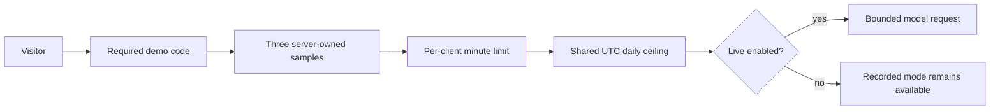

# AI Application Operating Economics

## One-Sentence Point

Every live model call has a variable cost, so free access must be a deliberately bounded acquisition or demonstration expense rather than an unmetered product promise.

## The Portfolio Decision

The Support Triage Studio is a professional showcase, not a growth-stage consumer application. Its operating model therefore optimizes for credible demonstration, predictable cost, and safe technical review:

| Experience | Who Pays | Boundary |
| --- | --- | --- |
| Recorded walkthrough | No inference charge | Open to every visitor. |
| Controlled live demo | Portfolio owner | Access code, three synthetic samples, client throttle, shared daily ceiling, and kill switch. |
| Deploy your own | Reviewer | Reviewer stores a provider key in their own server-side deployment. |
| Future support product | Customer or vendor | Subscription, included usage, overage, or customer cloud account. |

## Request Economics

The configured model request includes:

- A fixed prompt of approximately 1,150 characters.
- One synthetic ticket under 1,000 characters.
- A maximum of 300 output tokens.
- No model tools, search, images, audio, or multi-step loop.

At deployment time, recalculate the envelope from the selected model's published input and output prices. Treat this as an upper-bound estimate, then compare it with observed input and output token telemetry.

```text
estimated request cost =
  input tokens × input price per token
  + output tokens × output price per token
```

Do not treat a provider budget alert as the application spending boundary. The application claims from its own shared daily counter before making the provider request.

## Defense In Depth



Each control solves a different problem:

- The access code controls intended audience.
- The sample allowlist prevents use as a general-purpose proxy.
- The client limiter slows repeated calls from one apparent source.
- The shared counter caps aggregate calls across serverless instances.
- The kill switch stops all model spend without a code deployment.
- Recorded mode preserves the learning experience when live mode is stopped.

## Why Not Paste A Visitor Key?

A browser form would require the visitor to trust the page, its JavaScript, hosting path, logs, and dependencies with a billable credential. The safer interpretation of bring-your-own-key is bring-your-own-deployment: the reviewer places the credential directly into their hosting account, and this site never receives it.

## Business Model Progression

If the workflow later becomes a real product, evolve the operating model in stages:

1. Recorded public sandbox and a small live trial.
2. Team subscription with included ticket volume.
3. Metered overage for usage beyond the allowance.
4. Enterprise deployment with customer identity, audit, integrations, evaluation ownership, and retention controls.
5. Customer-cloud or customer-provider billing when procurement and security require it.

Funding can finance product development or customer acquisition, but it does not replace a credible relationship between revenue and inference cost.

## Metrics To Add Before Productization

- Model cost per successful triage.
- Contract-valid response rate.
- Latency percentiles.
- Daily ceiling utilization.
- Provider and spend-guard failure rates.
- Trial-to-paid conversion.
- Included usage consumed per paid account.
- Gross margin by account and workflow.

## Trainer Discussion Prompts

- Which part of the free experience creates customer confidence without requiring inference?
- Who should pay for unusually heavy usage?
- Which request types should use a cheaper model?
- What must happen when the spend guard is unavailable?
- When does bring-your-own-deployment create acceptable onboarding friction?
- Which controls are demo-grade, and which are required before real customer tickets?

## Current Source Guidance

- [OpenAI model pricing](https://developers.openai.com/api/docs/models/gpt-5.4-mini)
- [OpenAI API key safety](https://help.openai.com/en/articles/5112595-best-practices-for-api-key-safet)
- [OpenAI project budgets are soft thresholds](https://help.openai.com/en/articles/9186755-managing-projects-in-the-api-platform)
- [Upstash REST transactions](https://upstash.com/docs/redis/features/restapi)
- [Vercel Marketplace storage](https://vercel.com/docs/marketplace-storage)
